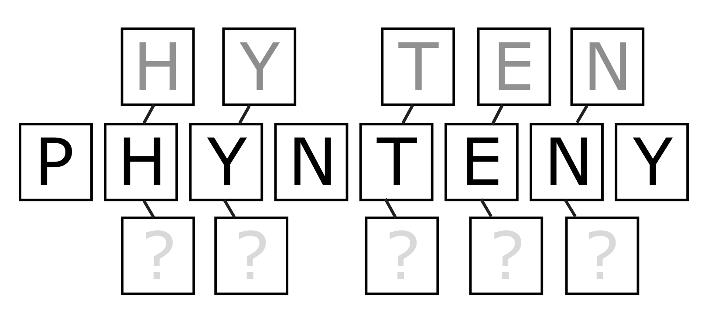
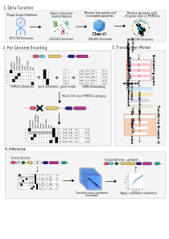

# Phynteny-Transformer 


`Phynteny` is annotation tool for bacteriophage genomes that integrates protein language models and gene synteny. `Phynteny` leverages a transformer architecture with attention mechanisms and long short term memory to capture the positional information of genes.

`Phynteny` takes a genbank file with PHROG annotations as input. If you haven't already annotated your phage(s) with [Pharokka](https://github.com/gbouras13/pharokka) and [phold](https://github.com/gbouras13/phold) go do that and then come right back here! 

### Dependencies

To run the Phynteny Transformer, you need the following dependencies:

- Python 3.9+
- torch
- numpy
- pandas
- click
- loguru
- BioPython
- transformers
- importlib_resources
- scikit-learn
- tqdm

You can install the dependencies using pip:

### Installation 

You can install Phynteny Transformer from source 
```
git clone https://github.com/susiegriggo/Phynteny_transformer 
cd Phynteny_transformer 
pip install . 
``` 

Pip and conda options coming soon 

#### Install Models 

Before you can run phynteny you'll need to install some databases

```
install_models
```

If you would like to install them to a specific location  

```
install_models -o <path/to/database_dir>
 ```

If this doesn't work you can download the models directly from [Zenodo](https://zenodo.org/records/15276214/files/phynteny_transformer_model0.1.1_2025-04-24.tar.gz) and untar them yourself and point Phynteny to them with the `-m` flag. 

### Quick Start 
```
phynteny_transformer  test_data/test_phages.gbk -o test_output
```


### Output 

* ```phynteny_transformer.gbk``` contains a GenBank format file that has been updated to include annotations generated using Phynteny along with their Phynteny score and confidence. 
* ```phynteny_per_cds_funcions.tsv``` provides a table of the annotations generated (similar to the ```pharokka_cds_functions.tsv from Pharokka```)


### Brief Overview 


### Advanced Usage

Phynteny Transformer provides an advanced mode for specifying the parameters of a model that you trained yourself. To see all advanced options:
```
phynteny_transformer --help --advanced
```

### Training Custom Models

Phynteny Transformer allows you to train your own custom models. To train a model, you need to provide a dataset in the required format and specify the training parameters. For more details, refer to the documentation in the train_transformer directory. 

## Bugs and Suggestions 
If you break Phynteny or would like to make any suggestions please open an issue or email me at susie.grigson@gmail.com and I'll try to get back to you. 

## Wow! how can I cite this?
Preprint available at ...
