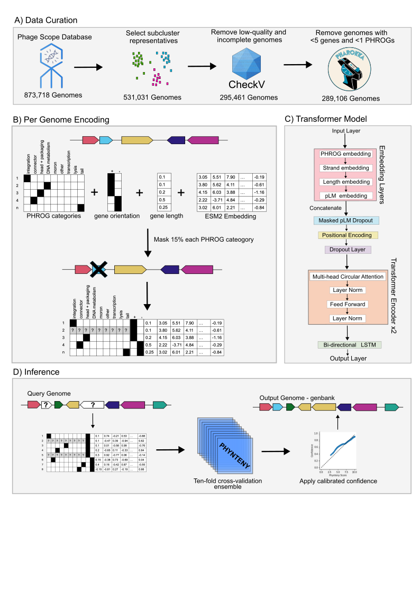

[](https://edwards.flinders.edu.au)
[](https://opensource.org/licenses/MIT)

[](https://pypi.org/project/phynteny_transformer/)

[](https://badge.fury.io/py/phynteny_transformer)
[](https://anaconda.org/bioconda/phynteny_transformer)


# Phynteny-Transformer 


Phynteny is annotation tool for bacteriophage genomes that integrates protein language models and gene synteny. ```phynteny-transformer``` leverages a transformer architecture with attention mechanisms and long short term memory to capture the positional information of genes.

```phynteny-transformer``` takes a genbank file with PHROG annotations as input. If you haven't already annotated your phage(s) with [Pharokka](https://github.com/gbouras13/pharokka) and [Phold](https://github.com/gbouras13/phold) go do that and then come right back here! 

### Dependencies

To run ```phynteny-transformer```, you need the following dependencies:

- Python 3.9+
- torch
- numpy
- pandas
- click
- loguru
- BioPython
- transformers
- importlib_resources
- scikit-learn
- tqdm

You can install the dependencies using pip:

### Installation 

You can install Phynteny from bioconda at [https://anaconda.org/bioconda/phynteny](https://anaconda.org/bioconda/phynteny_transformer). Make sure you have [`conda`](https://docs.conda.io/en/latest/) installed. 
```bash
# create conda environment and install phynteny
conda create -n phynteny_transformer -c bioconda phynteny_transformer
 
# activate environment
conda activate phynteny_transformer

# install phynteny
conda install -c bioconda phynteny_transformer
```

Now you can go to [Install Models](#install-models) to install pre-trained phynteny-transformer models. 

### Option 2: Installing Phynteny using pip
You can install Phynteny from PyPI at [https://pypi.org/project/phynteny/](https://pypi.org/project/phynteny_transformer/). 
```
pip install phynteny_transformer
```

Now you can go to [Install Models](#install-models) to install pre-trained phynteny models. 

### Option 3: Installing Phynteny from source

You can install Phynteny Transformer from source. 

```
git clone https://github.com/susiegriggo/Phynteny_transformer 
cd Phynteny_transformer 
pip install . 
```
**NOTE:** Source installation is recommended if you would like to train your own ```phynteny-trasformer``` models. 

#### Install Models 

Before you can run ```phynteny-transformer``` you'll need to install some databases

```
install_models
```

If you would like to install them to a specific location  

```
install_models -o <path/to/database_dir>
 ```

If this doesn't work you can download the models directly from [Zenodo](https://zenodo.org/records/15584824/files/phynteny_transformer_models_2025-06-03.tar.gz) and untar them yourself and point Phynteny to them with the `-m` flag. 

### Quick Start 
```
phynteny_transformer  test_data/test_phage.gbk -o test_output
```


### Output 

* ```phynteny_transformer.gbk``` contains a GenBank format file that has been updated to include annotations generated using Phynteny along with their Phynteny score and confidence. 
* ```phynteny_per_cds_funcions.tsv``` provides a table of the annotations generated (similar to the ```pharokka_cds_functions.tsv from Pharokka```)


### Brief Overview 


### Advanced Usage

Phynteny Transformer provides an advanced mode for specifying the parameters of a model that you trained yourself. To see all advanced options:
```
phynteny_transformer --help --advanced
```

### Training Custom Models

Phynteny Transformer allows you to train your own custom models. To train a model, you need to provide a dataset in the required format and specify the training parameters. For more details, refer to the documentation in the train_transformer directory. 

## Bugs and Suggestions 
If you break Phynteny or would like to make any suggestions please open an issue or email me at susie.grigson@gmail.com and I'll try to get back to you. 

## Acknowledgements 
Thankyou to Laura Inglis for designing the Phynteny logo! 

Phynteny was trained using resources provided by the Pawsey Supercomputing Research Centre (Perth, Australia) which is funded by the Australian Government. Analysis was performed using the Flinders University DeepThought High Performance Cluster (https://doi.org/10. 25957/FLINDERS.HPC.DEEPTHOUGHT).

## Wow! how can I cite this?
Preprint for Phynteny is available [here](https://www.biorxiv.org/content/10.1101/2025.07.28.667340v1][https://www.biorxiv.org/content/10.1101/2025.07.28.667340v1).<br>
You can cite Phynteny as:  <br>
Grigson, S.R., Bouras, G., Papudeshi, B., Mallawaarachchi, V., Roach, M.J., Decewicz, P., & Edwards, R.A. (2025). Synteny-aware functional annotation of bacteriophage genomes with Phynteny. bioRxiv, 2025.07.28.667340. https://doi.org/10.1101/2025.07.28.667340.

